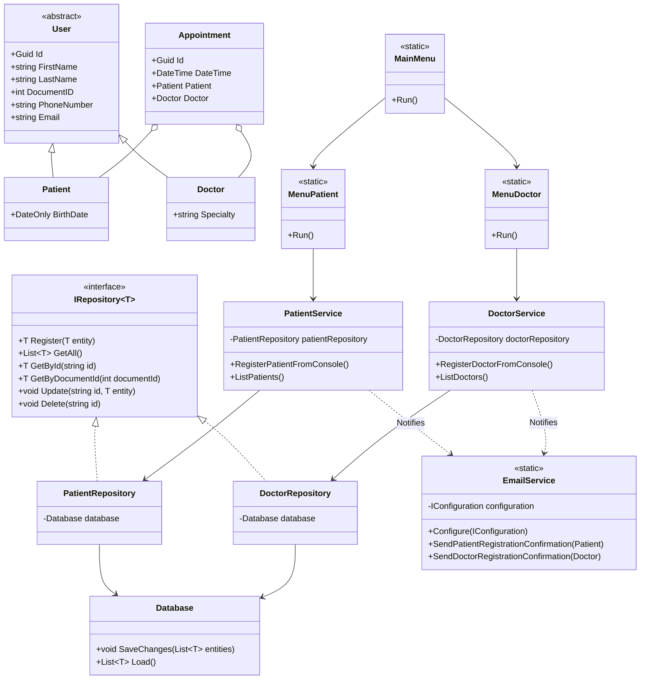

```mermaid
classDiagram
    class User {
        +Guid Id
        +string FirstName
        +string LastName
        +int DocumentID
        +string PhoneNumber
        +string Email
    }
    <<abstract>> User

    class Patient {
        +DateOnly BirthDate
    }
    User <|-- Patient

    class Doctor {
        +string Specialty
    }
    User <|-- Doctor

    class Appointment {
        +Guid Id
        +DateTime DateTime
        +Patient Patient
        +Doctor Doctor
    }
    Appointment o-- Patient
    Appointment o-- Doctor

    class IRepository~T~ {
        <<interface>>
        +T Register(T entity)
        +List~T~ GetAll()
        +T GetById(string id)
        +T GetByDocumentId(int documentId)
        +void Update(string id, T entity)
        +void Delete(string id)
    }

    class PatientRepository {
        -Database database
    }
    IRepository~Patient~ <|.. PatientRepository
    PatientRepository --> Database

    class DoctorRepository {
        -Database database
    }
    IRepository~Doctor~ <|.. DoctorRepository
    DoctorRepository --> Database

    class Database~T~ {
        +void SaveChanges(List~T~ entities)
        +List~T~ Load()
    }

    class PatientService {
        -PatientRepository patientRepository
        +RegisterPatientFromConsole()
        +ListPatients()
    }
    PatientService --> PatientRepository
    PatientService ..> EmailService : Notifies

    class DoctorService {
        -DoctorRepository doctorRepository
        +RegisterDoctorFromConsole()
        +ListDoctors()
    }
    DoctorService --> DoctorRepository
    DoctorService ..> EmailService : Notifies

    class EmailService {
        <<static>>
        -IConfiguration configuration
        +Configure(IConfiguration)
        +SendPatientRegistrationConfirmation(Patient)
        +SendDoctorRegistrationConfirmation(Doctor)
    }

    class MainMenu {
        <<static>>
        +Run()
    }
    MainMenu --> MenuPatient
    MainMenu --> MenuDoctor

    class MenuPatient {
        <<static>>
        +Run()
    }
    MenuPatient --> PatientService

    class MenuDoctor {
        <<static>>
        +Run()
    }
    MenuDoctor --> DoctorService
```
